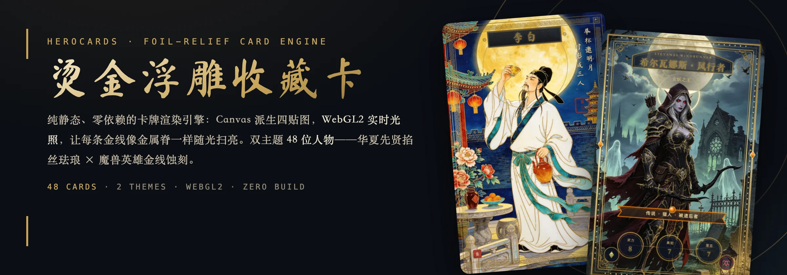
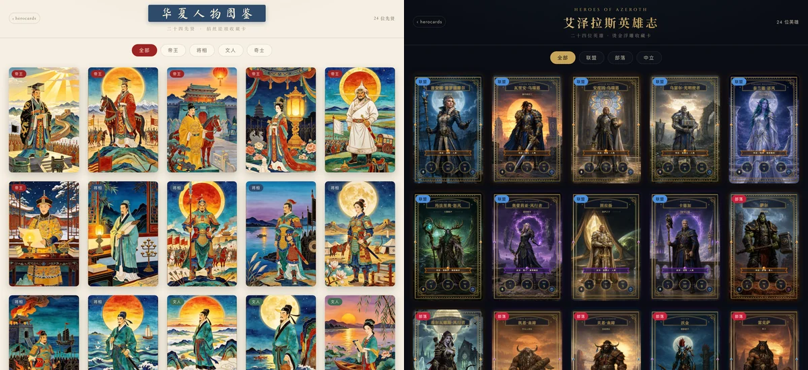
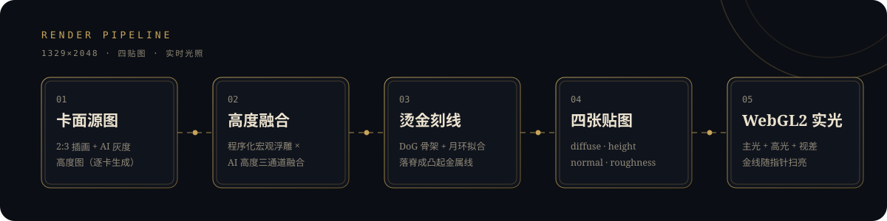

<p align="center">
  
</p>

<p align="center">
  <a href="https://coolbat.github.io/herocards/">在线体验</a> ·
  <a href="https://coolbat.github.io/herocards/app.html">华夏人物图鉴</a> ·
  <a href="https://coolbat.github.io/herocards/wow.html">艾泽拉斯英雄志</a>
</p>

## 这是什么

纯静态、零依赖的收藏卡渲染引擎：Canvas 2D 把一张 2:3 插画派生成 diffuse / height / normal / roughness 四张贴图，WebGL2 shader 做鼠标实时光照与视差——**画面里的金线是真实凸起的金属脊**，光扫过时整条亮起。同一套管线下跑着两个主题、各 24 位人物：

- **华夏人物图鉴** — 二十四先贤掐丝珐琅卡，附生平行旅图（经纬度投影大地图，可拖动缩放）
- **艾泽拉斯英雄志** — 魔兽世界英雄金线蚀刻卡（粉丝向学习演示）

<p align="center">
  
</p>

## 渲染管线



数据驱动路由：在 `js/heroes-data*.js` 里给人物加 `fullArt`（卡面源图）与 `fullArtHeight`（AI 高度图）字段即自动走全幅浮雕管线，未配置时回退肖像窗路径——新人物只加数据，不改渲染代码。逐卡金线禁区（`goldLineParams.skipZones`）与引导式月环（`moonHint`）是量产中唯一需要逐卡目检配置的环节。

## 本地运行

```bash
npm run dev           # 静态开发服务器（node server.mjs）
npm run check         # 语法检查 + 地图几何 / 打包测试
npm run build:pages   # 组装 GitHub Pages 发布目录 dist/pages/
npm run build:xhs     # 组装小红书小工具包 dist/xhs/（≤10MB 合规校验）
npm run build:atlas   # 从 Natural Earth 数据可复现重建行旅地图
```

## 仓库结构

```text
js/card-art.js        卡牌渲染管线核心（四贴图派生、烫金刻线、装饰层）
js/heroes-data.js     国风 24 先贤数据（唯一数据源契约）
js/heroes-data-wow.js 魔兽 24 英雄数据
js/showcase.js        展示站共享驱动（卡墙 / 详情 / 行旅图）
js/atlas-*.js         生平行旅图：地点注册表 → 统一投影 → 渲染
WORKFLOW.md           完整生产工作流（生图 SOP、QC 门槛、质量红线）
```

## 素材与版权

- 魔兽世界角色形象与设定版权归 Blizzard Entertainment 所有，本站仅作粉丝学习演示。
- 书法字体：Ma Shan Zheng（SIL OFL 1.1）；印面小篆：崇羲篆体（CC-BY-ND，仅使用其渲染字形）。
- 地图底图：Natural Earth / SRTM Plus（见 `assets/atlas/ATTRIBUTION.md`）。
